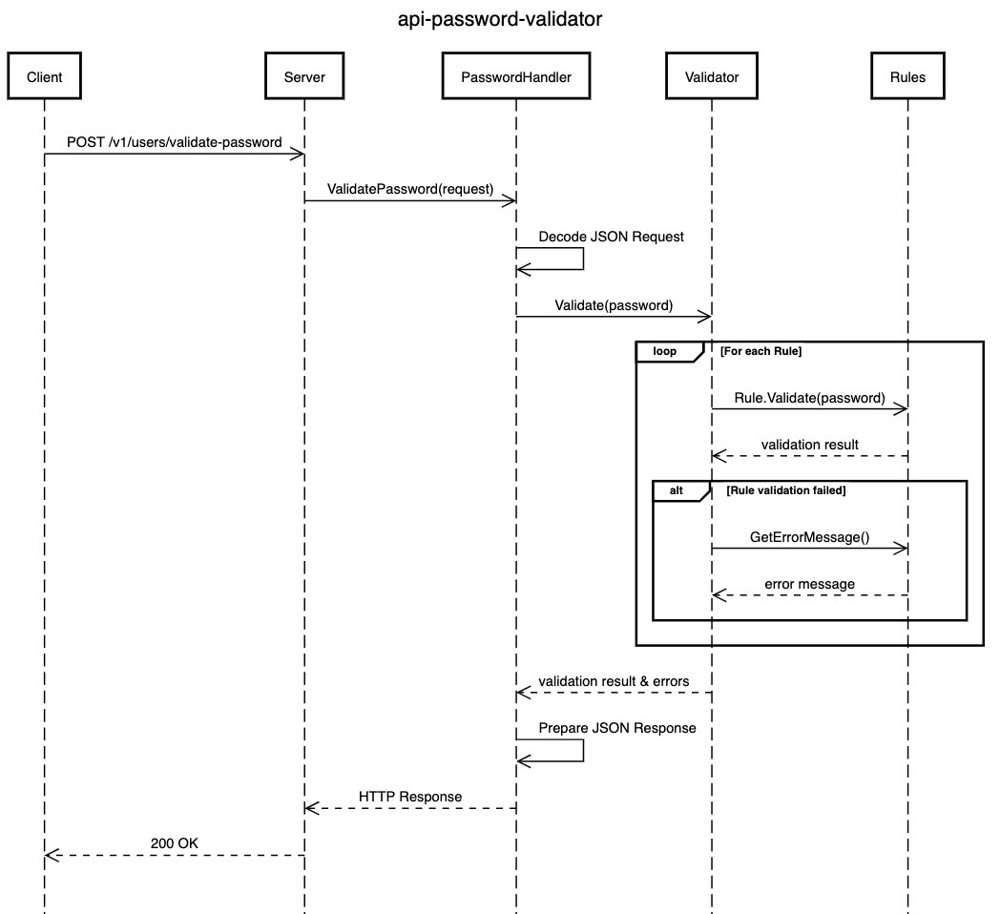

# Password Validator API

This REST API was built in Go using the [Chi](https://go-chi.io/) framework. This is a simple microservice that provides a RESTful API endpoint that can validate passwords based on a set of predefined rules.

## Table of Contents

- [Password Validator API](#password-validator-api)
    - [Features](#features)
        - [Sequence Diagram](#sequence-diagram)
        - [Available validators](#available-validators)
    - [API Usage](#api-usage)
        - [Validate password](#validate-password)
            - [Valid password](#valid-password)
            - [Invalid password](#invalid-password)
        - [Running the application](#running-the-application)
            - [Requirements](#requirements)
            - [Installation](#installation)
    - [Testing](#testing)
    - [Contributing](#contributing)

## Features

- RESTful API endpoint for password validation (`/v1/users/password-validation`).
- Modular rule-based validation system.
- Easy to extend and create new rules for validation.

### Sequence Diagram



_[sequencediagram.org](https://sequencediagram.org/index.html#initialData=C4S2BsFMAIEMAcQFp6wM5oO4HsBOATJAN1nBH1mDwChrVdQBjEVAO2GgGEzJ27YGIZmw4BlSLiIT+g4bHbQACuix58ACXn4ouGUxbyOANVLlKNevpHQASgFcoaWtxC9gSAHwfxkiQC4lAHlRABVoAHoiAEZwuzQJNEjTCmBIFBUcAmoAOWxU6GwpXC4edgAaHyKAgClRQOyAgG8AIlQMTPxmgOaAQQAjEPgATgBCADNsAGtmgF9aSolPD2V2tU1WbX9oEzIUyBXVAgAKXEgARztINGAASmoDjvXN3CWHta0dAIARSEZsfBgtXqtnOl2utDeBCeOiWOzMVFwATheyObUO+Du1HA2Gw8GgADE8NBILBGAALWwOSDUaC07bJcwvLz2RwBFmQAB0yMokFRGTUdzplMcSFhDIRARIu0oIGwrGgpzQDmANLpqtppA47OgUvhsvlY1gICg+HVQvp0oRS3ZaACAHFIMAAKK4XB4ACyVzQsAA5rzBebaTbRV5uRLia6iQBbL2+6lC3imxO0MN4EPLflQj5bXUpfUKq7K6AAMgjbtwTnumY02aZGdWWY2nyUp3ogLq2RBaHgcviEOr0MWSwWiOg6hCIUUXZ7rD7I-TLjcAQATAAGVfQQIAaRyeRghQk0BHZUX7BqHaazVzXWgwFwlzK0GaEnLaBvAG0ALpzIA)_

### Available validators

The application provides validators for the following rules:

- [DigitRule](https://github.com/vitorvasc/password-validator-api/blob/main/internal/domain/rule/digit_rule.go)
- [LowercaseRule](https://github.com/vitorvasc/password-validator-api/blob/main/internal/domain/rule/lowercase_rule.go)
- [MinLengthRule](https://github.com/vitorvasc/password-validator-api/blob/main/internal/domain/rule/min_length_rule.go)
- [NoRepeatedCharsRule](https://github.com/vitorvasc/password-validator-api/blob/main/internal/domain/rule/no_repeated_chars_rule.go)
- [SpecialCharRule](https://github.com/vitorvasc/password-validator-api/blob/main/internal/domain/rule/special_char_rule.go)
- [UppercaseRule](https://github.com/vitorvasc/password-validator-api/blob/main/internal/domain/rule/uppercase_rule.go)

## API Usage

### Validate password

#### Valid password

**Request**:

```bash
POST /v1/users/validate-password
Content-Type: application/json

{
    "password": "YourPwd123!"
}
```

**cURL**:

```
curl --location 'http://localhost:8080/v1/users/validate-password' \
    --header 'Content-Type: application/json' \
    --data '{
        "password": "YourPwd123!"  
    }'
```

**Response**:

```json
{
    "valid": true,
    "errors": []
}
```

#### Invalid password

**Request**:

```bash
POST /v1/users/validate-password
Content-Type: application/json

{
    "password": "YourPassword123!"    
}
```

**cURL**:

```
curl --location 'http://localhost:8080/v1/users/validate-password' \
    --header 'Content-Type: application/json' \
    --data '{
        "password": "YourPassword123!"      
    }'
```

**Response**:

```json
{
    "valid": false,
    "errors": [
        "must not contain repeated characters"
    ]
}
```

### Running the application

#### Requirements

- Go 1.23.0 or higher
- _(optional)_ Docker

#### Installation

To install the application, follow these steps:

1. Clone the repository

```bash
git clone https://github.om/vitorvasc/password-validator-api.git
```

2. Run the application

```bash
go run cmd/api/main/main.go
```

The server will start on port 8080 by default. 

## Testing

* Run the tests:
```bash
go test -v ./...
```

* Run the tests with coverage:

```bash
go test -v ./... -cover
```

## Contributing

Feel free to submit issues, fork the repository and create pull requests for any improvements. 
